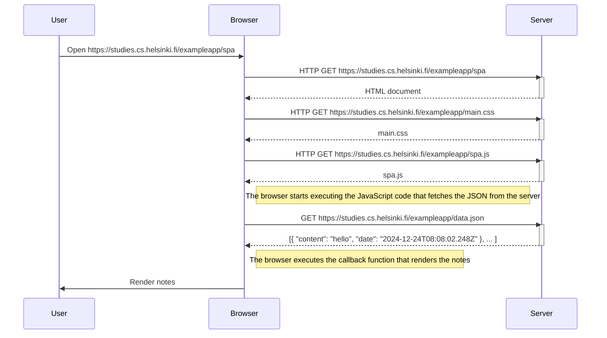

```mermaid
sequenceDiagram
    participant User
    participant Browser
    participant Server

    User->>Browser: Open https://studies.cs.helsinki.fi/exampleapp/spa
    Browser->>Server: HTTP GET https://studies.cs.helsinki.fi/exampleapp/spa
    activate Server
    Server-->>Browser: HTML document
    deactivate Server

    Browser->>Server: HTTP GET https://studies.cs.helsinki.fi/exampleapp/main.css
    activate Server
    Server-->>Browser: main.css
    deactivate Server

    Browser->>Server: HTTP GET https://studies.cs.helsinki.fi/exampleapp/spa.js
    activate Server
    Server-->>Browser: spa.js
    deactivate Server

    Note right of Browser: The browser starts executing the JavaScript code that fetches the JSON from the server

    Browser->>Server: GET https://studies.cs.helsinki.fi/exampleapp/data.json
    activate Server
    Server-->>Browser: [{ "content": "hello", "date": "2024-12-24T08:08:02.248Z" }, ... ]
    deactivate Server

    Note right of Browser: The browser executes the callback function that renders the notes
    Browser->>User: Render notes
```
