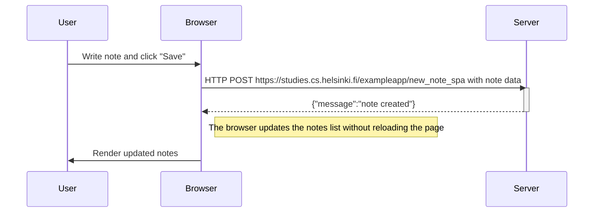

```mermaid
sequenceDiagram
    participant User
    participant Browser
    participant Server

    User->>Browser: Write note and click "Save"
    Browser->>Server: HTTP POST https://studies.cs.helsinki.fi/exampleapp/new_note_spa with note data
    activate Server
    Server-->>Browser: {"message":"note created"}
    deactivate Server

    Note right of Browser: The browser updates the notes list without reloading the page
    Browser->>User: Render updated notes
```
